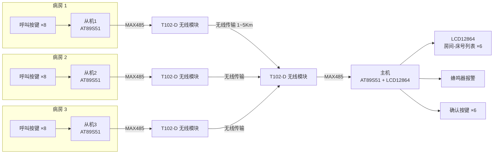
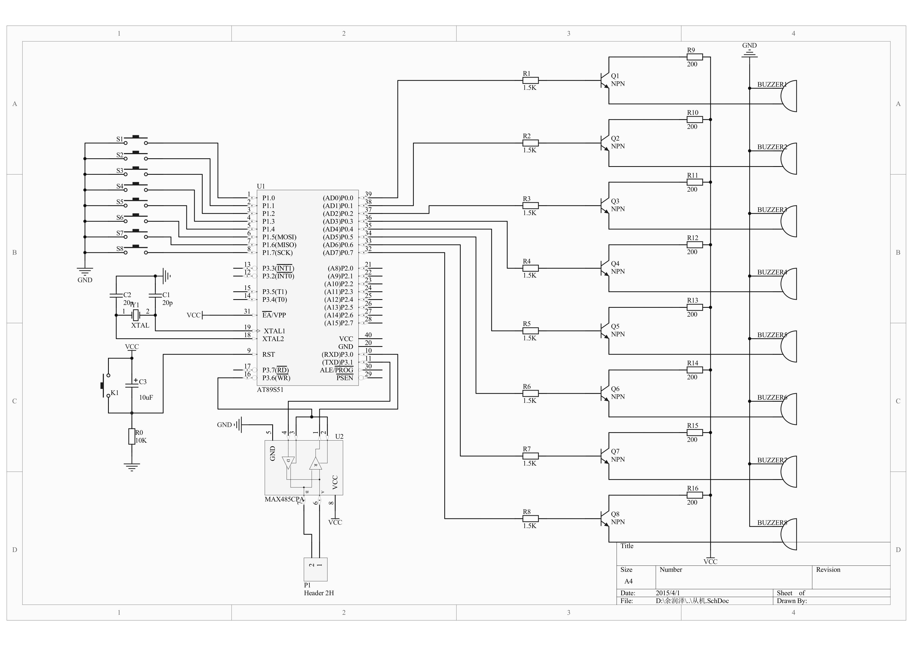
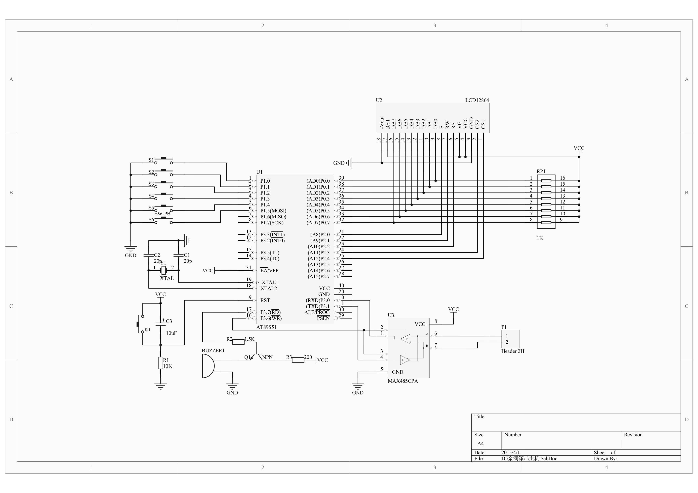
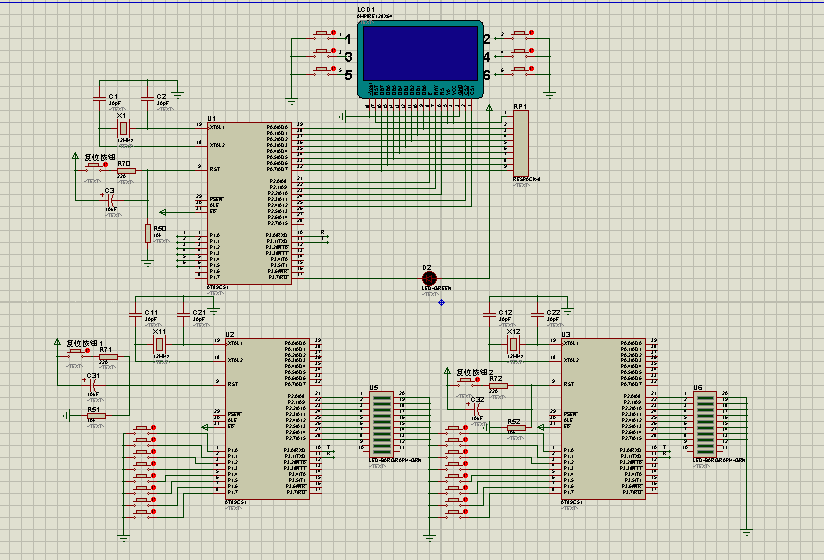
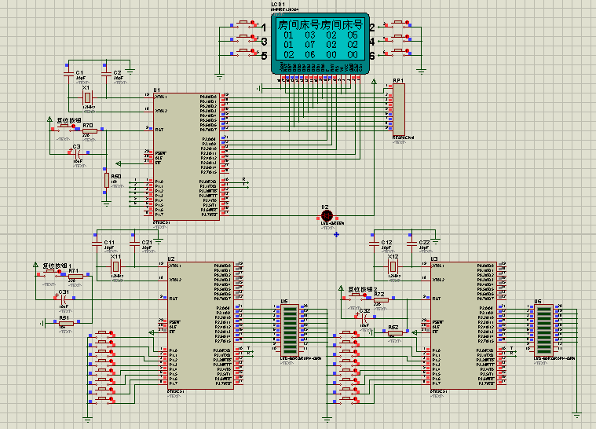

# 基于单片机的医院无线呼叫系统

[](LICENSE)
[-blue)]()
[-green)]()
[()

> 一个基于 **AT89S51 单片机** + **MAX485（RS-485 总线）** + **T102-D 无线模块** 的医院病房呼叫系统，
> 包含完整 C 源码、Proteus 仿真工程与 Altium Designer 原理图。

---

## 📋 项目简介

医院病房呼叫系统是患者在病床前向值班护士、医生发起呼叫的重要工具，可将患者的需求迅速传至值班室并在显示器上留下记录。然而实际中不少中小型医院并未安装呼叫系统，或因老化损坏沦为摆设，患者只能靠大声呼喊求助，极易错过抢救时间。

本设计针对上述问题，以 **AT89S51 单片机** 为核心，采用**主机 + 从机**结构：

- **3 个从机**分别安装于 3 间病房（每间 8 张病床），病床旁按键即可发起呼叫；
- 从机采集按键数据，经 **MAX485** 转为 RS-485 电平，由 **T102-D 无线模块** 无线发送至主机；
- **主机**（值班室）收到信号后，在 **LCD12864** 上同时显示最多 6 条"房间-床号"呼叫记录，蜂鸣器声光报警；护士响应后按下对应确认键即可清除记录。

系统由 **Keil C51** 编译源码生成固件，**Proteus** 完成整机电路仿真，**Altium Designer（DXP）** 绘制电路原理图。

## ✨ 功能特性

- 🛏️ 支持 **3 间病房 × 8 张病床** 独立呼叫，终端数量与每房床位数均可灵活增减
- 🖥️ 主机 **LCD12864** 实时显示最多 **6 条** "房间-床号"呼叫记录
- 🔔 主机收到呼叫后蜂鸣器间歇报警（约响 3 次），从机收到回执后本地声光提示
- ✅ 护士按键确认后清除对应记录，空位自动留给后续呼叫
- 📡 一字节数据帧协议（高 4 位房间号 + 低 4 位床号），主机回执 `0x55` 确认送达
- 🧩 独立式按键设计：一个按键损坏不影响其他，维护成本低
- 📦 完整配套：C 源码 / 固件（.hex）/ Proteus 仿真 / 系统原理图 / 单元模块电路

## 🏗️ 系统架构



**工作流程：**

1. 患者按下病床旁呼叫按键，从机 `key()` 扫描按键并去抖，映射出床号（1~8）；
2. 从机组合数据帧 `房间号|床号`（如 `0x13` = 房间 1 床 3），经 MAX485 转 RS-485 电平，由 T102-D 模块透明传输无线发出；
3. 主机经无线模块、MAX485 收到数据，串口中断触发，`datadeal()` 解析房间号/床号存入队列；
4. 主机回发 `0x55` 回执，并驱动蜂鸣器报警（定时器中断每 500ms 翻转一次，约响 3 次）；
5. LCD12864 分 3 行显示"房间 床号"列表（最多 6 条），超出后等待护士处理；
6. 从机收到回执后，P2 口输出声光提示约 1 秒（呼叫已送达）；
7. 护士响应后按下对应确认键（P1.0~P1.5），该条记录清零，后续呼叫可继续显示。

## 📐 系统原理图

主机与从机电路的 Altium Designer（DXP）原理图：





## 🔌 硬件设计

系统硬件电路由 **电源、通信、时钟、复位、显示、按键、声光报警** 七部分组成。

### 元器件选型

| 模块 | 型号 | 关键参数 | 用途 |
| ---- | ---- | -------- | ---- |
| 主控 | **AT89S51**（ATMEL） | 4KB ISP Flash、128B RAM、32 个 I/O、2×16 位定时器、6 中断源、全双工 UART、看门狗 | 系统控制核心 |
| 通信 | **MAX485**（Maxim） | 单 +5V 供电、静态电流 300μA、半双工、TTL↔RS-485 电平转换 | RS-485 总线收发 |
| 无线 | **T102-D**（TRACON） | GFSK 调制、半双工透明传输、1~5Km、19200bps、RS232/RS485/TTL 接口 | 主从机无线传输 |
| 显示 | **LCD12864**（无字库，Proteus 中为 AMPIRE128X64） | 128×64 点阵、双片选（CSA/CSB）、8 位并行接口 | 显示呼叫记录 |
| 电源 | **LM7805** 三端稳压 | 输入 7~35V，输出 +5V | 系统稳压供电 |

> **T102-D 无线模块**（5 脚接口）：`VCC`(+5V) / `GND` / `RS485A` / `RS485B` / `CE`（使能，接 +5V）。
> 采用透明传输方式，RS-485 数据"所发即所收"，只需在 MAX485 的 A、B 线之间串入无线模块，即可实现无线 485 通信。

### 各单元电路

| 单元 | 电路说明 |
| ---- | -------- |
| **电源电路** | 市电经 T4 变压器降压 → 整流桥 B1 整流 → LM7805 稳压 + 滤波电容 → 稳定 +5V 直流 |
| **通信电路** | MAX485 的 RO/DI 接单片机 RXD/TXD（P3.0/P3.1），/RE+DE 由单脚控制收发切换，A/B 差分端加 100Ω 匹配电阻 |
| **时钟电路** | 12MHz 晶振 + 陶瓷电容构成内部振荡电路，主从机同频晶振、同波特率保证通信正确 |
| **复位电路** | 按键复位方式，RST 高电平复位、低电平开始从 0000H 执行 |
| **显示电路** | LCD12864 8 位数据口接 P0 口，CSA/CSB/RS/RW/E 控制线接 P2.4~P2.0 |
| **按键电路** | 主从机均采用独立式按键（P1 口），从机 8 键对应 8 张病床，主机 6 键对应 6 条记录 |
| **声光报警** | P3.7 输出高电平 → NPN 三极管导通 → 蜂鸣器通电发声 |

**主机引脚连接**（`master.c` 定义）：

| 单片机引脚 | 外设 | 说明 |
| ---------- | ---- | ---- |
| P0.0~P0.7  | LCD12864 DB0~DB7 | 8 位数据总线 |
| P2.4 / P2.3 | LCD12864 CSA / CSB | 左/右半屏片选（低电平有效） |
| P2.2       | LCD12864 RS(DI)   | H=数据，L=指令 |
| P2.1 / P2.0 | LCD12864 RW / E   | 读/写选择；使能（高电平有效） |
| P1.0~P1.5  | 确认按键 ×6       | 清除对应呼叫记录 |
| P3.7       | 蜂鸣器（NPN 驱动）| 呼叫报警 |
| P3.0/P3.1  | MAX485 RO/DI      | 串口收发（经 T102-D 无线传输） |

**从机引脚连接**（`slaveN.c` 定义）：

| 单片机引脚 | 外设 | 说明 |
| ---------- | ---- | ---- |
| P1.0~P1.7  | 呼叫按键 ×8 | 对应 8 张病床 |
| P2.0~P2.7  | 声光提示 | 收到主机回执后输出约 1 秒 |
| P3.0/P3.1  | MAX485 RO/DI | 串口收发（经 T102-D 无线传输） |

## 📡 通信协议

串口波特率 **9600**（主从机一致），1 字节数据帧：

```
┌──────────────┬──────────────┐
│ 高 4 位       │ 低 4 位       │
│ 房间号        │ 床号          │
│ (1/2/3)      │ (1~8)        │
└──────────────┴──────────────┘
```

| 发送方 | 数据帧 | 含义 |
| ------ | ------ | ---- |
| 从机 1 | `0x10 \| 床号` | 房间 1 的某床位呼叫（如 0x13 = 房间 1 床 3） |
| 从机 2 | `0x20 \| 床号` | 房间 2 的某床位呼叫 |
| 从机 3 | `0x30 \| 床号` | 房间 3 的某床位呼叫 |
| 主机   | `0x55`         | 接收确认回执（ACK），从机收到后本地提示 |

**床号按键映射**（从机 P1 口，低电平有效）：

| 按键电平 | 床号 | 按键电平 | 床号 |
| -------- | ---- | -------- | ---- |
| `0xFE`   | 1    | `0xEF`   | 5    |
| `0xFD`   | 2    | `0xDF`   | 6    |
| `0xFB`   | 3    | `0xBF`   | 7    |
| `0xF7`   | 4    | `0x7F`   | 8    |

## 💻 软件设计

软件分为主机程序与从机程序两部分：

**主机程序**（`master.c`）：由键盘读取、LCD 显示、串口中断服务、提示（报警）四部分组成。

- 串口中断为核心：收到数据 → `datadeal()` 解析并存入队列 → `send()` 回发 `0x55` → 启动蜂鸣器定时报警；
- 定时器 0 中断：每 500ms 翻转 P3.7，使蜂鸣器间歇鸣响，约 3 次后自动停止（`Btime > 4` 关断）；
- `key()`：扫描 6 个确认按键，按下后清除对应 `room[i]/bed[i]` 记录；
- 显示：`display0()` 绘制"房间 床号"固定汉字标题，`display1()` 动态刷新 6 组数字。

**从机程序**（`slave1~3.c`）：由键盘扫描、数据发送、回执接收、提示四部分组成。

- `key()`：扫描 8 个按键并软件去抖，映射床号 1~8；
- `send()`：发送 `0x10/0x20/0x30 | 床号`（房间号在源码注释处修改，即从机编号）；
- `receive()`：阻塞等待主机回执，收到后 P2 口输出声光提示约 1 秒。

## 🖥️ Proteus 仿真

### 仿真电路



> 仿真说明：受 Proteus 模型限制，仿真中省略了 MAX485 及无线模块，将主机与从机的
> RXD/TXD（P3.0/P3.1）直接相连，等效验证主从机通信与显示逻辑。

### 仿真运行



**仿真操作步骤：**

1. 用 [Proteus](https://www.labcenter.com/) 打开根目录 `仿真.DSN`；
2. 为主机芯片加载 `master.hex`，从机芯片加载 `slave1.hex` / `slave2.hex` / `slave3.hex`；
3. 运行仿真，按下从机按键发起呼叫：
   - 从机对应提示灯亮，表示按键已采集；
   - 主机 LCD 显示对应"房间 床号"，提示灯亮 3 下（实际硬件中为蜂鸣器响 3 次）；
   - 主机回发回执，从机提示灯点亮约 1 秒，表示呼叫送达；
4. 按下主机显示边上的清除按键，对应记录清零，后续呼叫可继续显示。

## 📁 目录结构

```
.
├── master.c            # 主机程序：串口接收、LCD12864 显示、蜂鸣器报警、按键确认
├── master.hex          # 主机固件（Keil C51 编译输出，供 Proteus 加载）
├── slave1.c            # 从机 1（房间 1）：按键扫描 + 0x10|床号 发送
├── slave1.hex          # 从机 1 固件
├── slave2.c            # 从机 2（房间 2）：0x20|床号
├── slave2.hex          # 从机 2 固件
├── slave3.c            # 从机 3（房间 3）：0x30|床号
├── slave3.hex          # 从机 3 固件
├── reg51.h             # 8051 寄存器定义头文件（Keil 标准头文件）
├── 仿真.DSN            # Proteus 仿真工程（整机电路仿真）
├── images/             # README 引用图片（Proteus 仿真图）
├── PCB原理图/          # Altium Designer（DXP）原理图
│   ├── 主机.SchDoc     # 主机原理图
│   ├── 从机.SchDoc     # 从机原理图
│   ├── LCD12864.SchLib # LCD12864 元件库
│   ├── 1.jpg           # 原理图截图
│   └── 2.jpg           # 原理图截图
└── README.md
```

## 📝 代码说明

| 文件 | 说明 |
| ---- | ---- |
| `master.c` | 主机主程序。`UART_init()` 初始化串口（9600，定时器 1 方式 2）；串口中断 `receive()` 接收呼叫帧、`datadeal()` 解析房间/床号入队、`send()` 回发 `0x55`；`display0()/display1()` 绘制固定汉字标题与动态数字；定时器 0 中断驱动蜂鸣器间歇报警（500ms 翻转）；`key()` 扫描确认按键清除记录。 |
| `slave1~3.c` | 从机程序。`key()` 扫描 8 个呼叫按键并去抖；`send()` 发送 `0x10/0x20/0x30 \| 床号` 帧；`receive()` 等待主机回执后驱动 P2 口声光提示约 1 秒。三文件结构相同，仅房间号不同。 |
| `reg51.h` | 8051 系列单片机特殊功能寄存器（SFR）标准定义头文件。 |

## 🛠️ 开发工具

| 用途 | 工具 |
| ---- | ---- |
| 源码编译 | Keil C51（uVision） |
| 电路仿真 | Proteus EDA |
| 原理图设计 | Altium Designer（DXP） |

## 📄 许可证

本项目基于 [MIT License](LICENSE) 开源，欢迎学习、使用与改进。

---

*代码为原始工程文件（仅补充注释，未改动逻辑）。*
